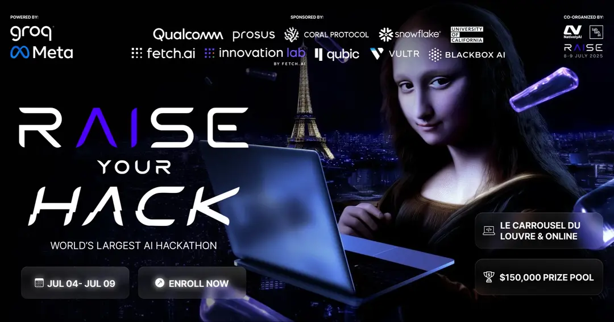
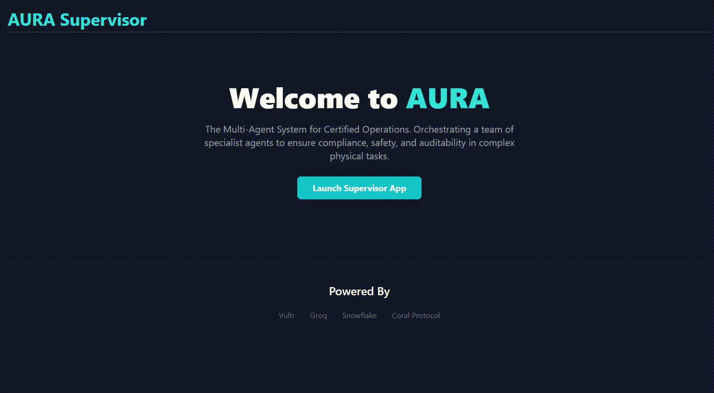
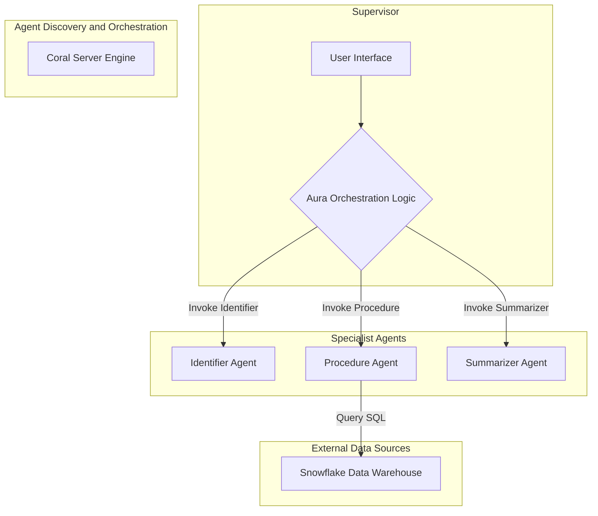

# AURA - The AI Supervisor for Enterprise Operations



**AURA is an AI-powered, multi-agent system designed to act as a first-responder for high-stakes operational tasks. It orchestrates a team of specialized AI agents to diagnose problems, fetch official procedures, and guide technicians, turning minutes of chaos into seconds of controlled, auditable action.**

---

| Status         | Value                                                                                             |
| -------------- | ------------------------------------------------------------------------------------------------- |
| **Project**    | AURA (AI Unified Response Agent)                                                                  |
| **Hackathon**  | [RAISE Your HACK](https://lablab.ai/event/raise-your-hack)                                        |
| **Track**      | **Vultr**: Agentic Workflows for the Future of Work                                               |
| **Live Demo**  | **[http://95.179.217.110/](http://95.179.217.110/)** <!-- CRITICAL: UPDATE THIS --> |
| **Repo**       | [https://github.com/Nabil-Mabrouk/aura](https://github.com/Nabil-Mabrouk/aura)                    |

---

## 🚀 The Demo

Here is a live demonstration of the AURA Supervisor orchestrating a full incident response workflow on a production-grade cloud environment.

  <!-- CRITICAL: Record a GIF of your live app working! -->

---

## The Problem: Chaos in Enterprise Operations

When critical infrastructure experiences an outage or requires maintenance, on-call engineers face a high-pressure, manual, and often chaotic process:
1.  Acknowledging alerts and finding the right system.
2.  Manually running diagnostics and sifting through logs to pinpoint root causes.
3.  Scrambling to locate the correct, often lengthy, official Standard Operating Procedure (SOP) or runbook.
4.  Executing fixes under stress, increasing the risk of human error and prolonged downtime.

This leads to costly downtime, missed SLAs, and significant technician burnout.

## Our Solution: AURA, The AI First-Responder

AURA transforms this reactive chaos into a proactive, calm, and auditable workflow. It's an **AI Supervisor** that acts as the on-call engineer's intelligent partner.

When an alert comes in, AURA automatically:
1.  **Delegates** initial analysis to a specialist **Identifier Agent** (e.g., to identify hardware from visual input).
2.  **Orchestrates** a secure **Procedure Agent** to fetch the precise, official runbook from the enterprise's **Snowflake** data warehouse.
3.  **Guides** the technician step-by-step through the exact, approved remediation process.
4.  **Assigns** the final report writing to a **Summarizer Agent**.
5.  **Logs** every action for a fully auditable compliance trail.

AURA doesn't replace the human; it augments them, handling repetitive, time-consuming tasks and providing crucial context, allowing the technician to focus on high-level oversight and decision-making.

---

## 🛠️ How It Works: A Multi-Agent Architecture

AURA is not a single application; it's a dynamic system of collaborating microservices, orchestrated by the Supervisor and discovered via **Coral Protocol**.



---

## 🏆 Tech Stack & Sponsor Integration: Production-Ready Design

AURA is built with a robust, enterprise-grade stack, strategically leveraging sponsor technologies to demonstrate real-world applicability.

*   **Vultr**: The entire multi-service application is deployed on **Vultr Cloud Compute**. Vultr's reliable, high-performance infrastructure is the backbone, hosting all components (Nginx, Docker containers, systemd-managed services).
*   **Docker & Docker Compose**: The core Django Supervisor, Celery worker, and PostgreSQL database are containerized for isolation, portability, and streamlined deployment.
*   **Nginx**: Acts as the production-grade reverse proxy, handling public traffic on standard ports (80/443), routing requests to internal services, and ensuring a single, secure entry point.
*   **systemd**: Manages the lifecycle of critical background services like the `coral-server` and `coral-studio`, ensuring they are always running and automatically restart on failure.
*   **PostgreSQL**: Provides a robust, scalable, and reliable relational database for the Django application, replacing SQLite for production.
*   **Coral Protocol**: The heart of our agent orchestration. The `coral-server` dynamically launches and manages our specialist agents from `application.yaml` configurations, allowing the Supervisor to discover and delegate tasks to them. The `coral-studio` provides visual management.
*   **Snowflake**: Integrated as the single source of truth for all operational procedures. Our **Procedure Agent** connects directly to Snowflake, demonstrating secure and compliant enterprise data retrieval.
*   **Groq (Planned)**: While currently using mocked logic, the architecture is designed for future integration with the **Groq API** (e.g., Llama 3). This will power real-time AI capabilities like intent understanding (via a new Command Agent) and potentially advanced vision tasks, leveraging Groq's low-latency inference.
*   **Open-source LLMs / RAG**: The modular agent design supports easy integration of open-source LLMs and Retrieval-Augmented Generation (RAG) for enhanced intelligence.

---

## ⚙️ Setup & Installation

You can run the entire AURA system locally using Docker, or follow the comprehensive cloud deployment guide.

### Prerequisites
*   [Docker](https://www.docker.com/products/docker-desktop/)
*   [Docker Compose](https://docs.docker.com/compose/install/)
*   Git

### Local Development

1.  **Clone the repository:**
    ```bash
    git clone https://github.com/Nabil-Mabrouk/aura.git
    cd Aura
    ```

2.  **Configure Environment Variables:**
    Create a `.env` file in the `agents/procedure_agent/` directory:
    ```bash
    cp agents/procedure_agent/.env.example agents/procedure_agent/.env
    ```
    Edit `agents/procedure_agent/.env` with your Snowflake credentials.

3.  **Run the System:**
    Launch the entire application stack:
    ```bash
    docker-compose up --build
    ```

4.  **Access the Application:**
    *   **Aura Landing Page:** `http://localhost:8000/`
    *   **Aura Supervisor App:** `http://localhost:8000/app/`

---

## 📚 Project Documentation

Explore the detailed development journey and deployment process:

*   **Day 1 Article: Aura's Genesis: From Concept to a Local Multi-Agent System on Day 1**
    *   **[Link to your Day 1 Article in docs/hackathon/](docs/hackathon/day1.md)** 
*   **Day 2 Article: From Local to Cloud: Deploying Aura's Multi-Agent System to Vultr**
    *   **[Link to your Day 2 Article in docs/hackathon/](docs/hackathon/day2.md)** 
*   **Full Deployment Guide: Deploying a Robust Multi-Agent AI System to Vultr**
    *   **[Link to your full deployment guide in docs/hackathon/](docs/hackathon/day2.md)** 

---

## 🔮 Future Work & AI Enhancement Goals

*   **[Mandatory] Groq/Llama Integration (Day 3 Focus):** Implement real-time Speech-to-Text via a new "Command Agent" using the Groq API (Llama 3) for intent parsing.
*   **Multi-Modal Interaction (Day 4 Focus):**
    *   **Real-time Video Object Detection:** Upgrade the Identifier Agent to use a pre-trained YOLOv8 model for visual component recognition from a live camera feed.
    *   **Text-to-Speech Response:** Enable AURA to speak its responses aloud, guiding the technician verbally.
*   **[Scalability] Secure Non-Root Execution:** Transition service execution from `root` to a dedicated, less privileged user for enhanced security.
*   **[Data] Historical Job Analysis:** Leverage Snowflake or other data warehousing tools for deeper analysis of past operational incidents.

---
Built with ❤️ by [Nabil Mabrouk] for the RAISE Your HACK hackathon.

---


