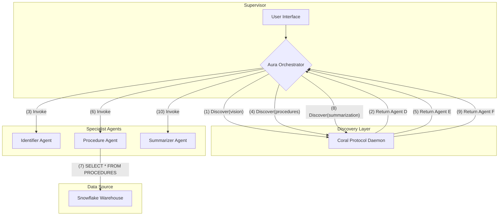

# AURA - The AI Supervisor for Enterprise Operations

 <!-- Optional: Create a cool banner with Canva -->

**AURA is an AI-powered, multi-agent system designed to act as a first-responder for high-stakes operational tasks. It orchestrates a team of specialized AI agents to diagnose problems, fetch official procedures, and guide technicians, turning minutes of chaos into seconds of controlled, auditable action.**

---

| Status         | Value                                                                                         |
| -------------- | --------------------------------------------------------------------------------------------- |
| **Project**    | AURA (AI Unified Response Agent)                                                              |
| **Hackathon**  | [RAISE Your HACK](https://lablab.ai/event/raise-your-hack)                                    |
| **Track**      | **Vultr**: Agentic Workflows for the Future of Work                                           |
| **Live Demo**  | **[http://your-vultr-ip-address/](http://your-vultr-ip-address/)** <!-- IMPORTANT: UPDATE THIS --> |
| **Repo**       | [https://github.com/Nabil-Mabrouk/aura](https://github.com/Nabil-Mabrouk/aura)      |

---

## 🚀 The Demo

Here is a live demonstration of the AURA Supervisor orchestrating a full incident response workflow.

  <!-- CRITICAL: Record a GIF of your app working! -->

---

## The Problem: 

..in progress

## Our Solution: AURA, The AI First-Responder

AURA transforms this chaotic process into a calm, supervised workflow. It's an **AI Supervisor** that acts as the on-call engineer's perfect partner.

When an alert comes in, AURA automatically:
1.  **Delegates** the initial analysis to a specialist **Identifier Agent**.
2.  **Discovers** and tasks a secure **Procedure Agent** to fetch the official runbook from the enterprise data warehouse.
3.  **Guides** the technician through the exact, approved steps.
4.  **Assigns** the final report writing to a **Summarizer Agent**.
5.  **Logs** every action for a fully auditable compliance trail.

AURA doesn't replace the human; it empowers them by handling the repetitive, time-consuming tasks, allowing the human to focus on final approval and high-level oversight.

---

## 🛠️ How It Works: A Multi-Agent Architecture

AURA is not a single application; it's a system of collaborating microservices, orchestrated by the Supervisor and discovered via **Coral Protocol**.


---

## 🏆 Tech Stack & Sponsor Integration

We strategically used the sponsor technologies to build a robust, enterprise-ready system.

*   **Vultr**: The entire multi-service application is deployed on **Vultr Cloud Compute**. Vultr's reliable and high-performance infrastructure is the backbone of AURA, hosting the Supervisor, all specialist agents, and the Coral daemon.

*   **Groq**: While our current agents use simulated logic for the demo, the architecture is designed for the **Groq API**. The Summarizer and Identifier agents are primed to have their core logic replaced with calls to Llama-3 on Groq's LPU for lightning-fast inference, a critical requirement for real-time operations.

*   **Snowflake**: We use Snowflake as the single source of truth for all operational procedures. Our **Procedure Agent** connects directly to a Snowflake data warehouse to pull official, version-controlled runbooks, ensuring AURA always follows enterprise compliance and safety standards.

*   **Coral Protocol**: Coral is the collaboration fabric of our system. Instead of hardcoding agent endpoints, the **Aura Supervisor** uses the Coral SDK to dynamically **discover** and **invoke** agents based on their advertised capabilities. This creates a modular, scalable, and secure multi-agent architecture.

---

## ⚙️ Setup & Installation

You can run the entire AURA system on your local machine using Docker.

### Prerequisites
*   [Docker](https://www.docker.com/products/docker-desktop/)
*   [Docker Compose](https://docs.docker.com/compose/install/)
*   Git

### Local Development

1.  **Clone the repository:**
    ```bash
    git clone https://github.com/Nabil-Mabrouk/aura.git
    cd your-repo
    ```

2.  **Configure Environment Variables:**
    Create a `.env` file in the `agents/procedure_agent/` directory. Use the example file as a template:
    ```bash
    cp agents/procedure_agent/.env.example agents/procedure_agent/.env
    ```
    Now, edit `agents/procedure_agent/.env` with your Snowflake credentials.

3.  **Run the System:**
    The entire application stack is defined in `docker-compose.yml`. Launch everything with a single command:
    ```bash
    docker-compose up --build
    ```

4.  **Access the Application:**
    *   **Aura Landing Page:** `http://localhost:8000/`
    *   **Aura Supervisor App:** `http://localhost:8000/app/`

---

## 🔮 Future Work (Stretch Goals)

*   **[Enhancement] Implement Live YOLOv8 Inference:** Upgrade the Identifier Agent to use a real YOLOv8 model deployed on a **Vultr GPU Instance** for real-time video analysis.
*   **[Enhancement] Add Voice Interaction:** Implement a "Command Agent" and use the Web Speech API to allow technicians to interact with AURA using voice commands.
*   **[DevOps] Deploy to Vultr Kubernetes Engine (VKE):** For true production-grade scalability, migrate the agent services to a VKE cluster.

---
Built with ❤️ by [Nabil Mabrouk] for the RAISE Your HACK hackathon.

